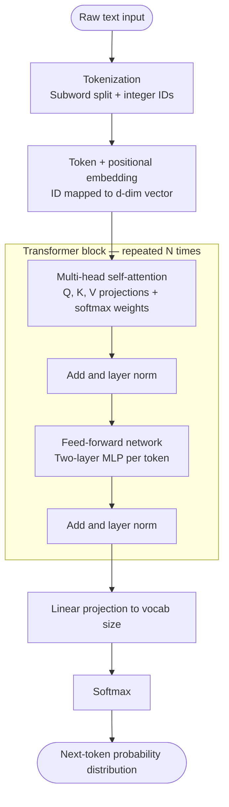

# How transformers work: tokens, attention, and blocks

## Tokens

A token is the atomic unit a language model operates on. Tokenization is not word-splitting 
it is a learned subword compression, typically using Byte-Pair Encoding (BPE) or a similar
algorithm. The vocabulary is fixed at training time (commonly 32k–100k tokens). Each token ID
is looked up in an embedding matrix to produce a dense vector in R^d (where d is the model
dimension e.g. 768, 2048, 4096). A positional encoding is added to this vector so the model
knows where in the sequence each token sits; modern models use Rotary Position Embedding (RoPE)
or ALiBi rather than the original sinusoidal scheme, because they generalize better to sequence
lengths not seen during training.

## Attention

Self-attention is the mechanism by which tokens read information from each other. For each token
acting as a query, the model computes a dot product between its query vector Q and the key vectors
K of every other token, scales by 1/sqrt(d_k) to prevent vanishingly small gradients, then applies
softmax to produce a normalized weight distribution over positions. Those weights are used to form
a weighted sum of value vectors V, yielding a new, context-aware representation of the query token.

Multi-head attention runs this operation H times in parallel, each head projecting into a lower-
dimensional subspace. Each head can specialize — one might track syntactic agreement, another
coreference, another positional proximity. The H outputs are concatenated and projected back to d.
The computational cost is O(n^2 * d) in sequence length n, which is the core bottleneck that
motivates attention approximations (FlashAttention, sliding-window attention, etc.).

## Transformer blocks

A single transformer block applies:

1. Multi-head self-attention (with a residual connection: x = x + Attention(LayerNorm(x)))
2. A position-wise feed-forward network — two linear layers with a nonlinearity (GELU is standard),
   applied independently to each token position (with another residual: x = x + FFN(LayerNorm(x)))

The residual connections are not optional decoration — they are what makes deep networks trainable
by providing a gradient highway that bypasses each sub-layer. Layer normalization stabilizes
activations across the depth of the stack. A full model stacks N such blocks (GPT-2: 12–48,
LLaMA 3 70B: 80), followed by a final layer norm, a linear projection to vocabulary size, and a
softmax to produce a probability distribution over the next token.

Early layers tend to learn low-level syntactic patterns; middle and later layers encode semantic
and factual knowledge. The feed-forward sublayer, which accounts for roughly two-thirds of
parameters in a standard transformer, is thought to act as a key-value memory store for factual
associations.

---

## Flow diagram

---

## Key numbers to hold in your head

| Concept | Typical scale |
|---|---|
| Token vocabulary | 32k – 128k |
| Embedding dimension d | 768 (small) to 8192 (large) |
| Attention heads | 12 – 128 |
| Transformer blocks | 12 (GPT-2 small) to 96+ (large frontier models) |
| Attention complexity | O(n^2 * d) in sequence length |
| Parameters in FFN vs attention | ~2:1 ratio |
